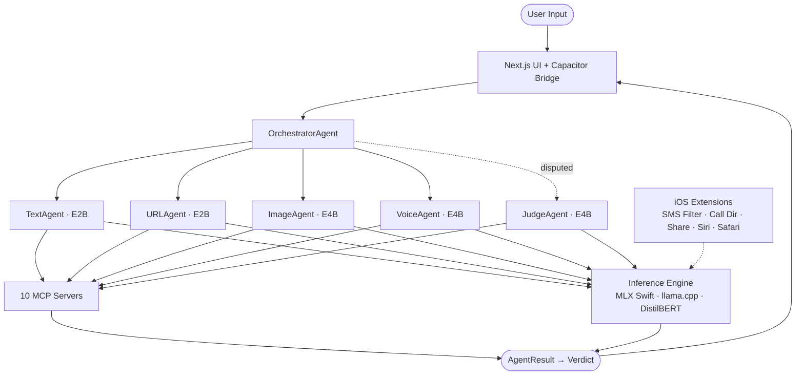

# GemScan

On-device AI scam detection that protects elders and youth from scams, sextortion, and fraud — without sending data to the cloud.

## Why This Exists

In 2023, a mother in Arizona answered her phone and heard her teenage daughter screaming in terror. A voice — indistinguishable from her daughter's own — begged for help, claiming she'd been kidnapped. A man then demanded a ransom. The daughter was safe at home the entire time. A three-second audio clip scraped from social media was all it took to clone her voice.

That same year, over 12,600 minors were financially sextorted after being manipulated into sharing intimate images online. At least 20 died by suicide. Meanwhile, the FBI documented **$16.6 billion in US fraud losses in 2024 (+33% YoY)**, with elder victims accounting for $4.885 billion. Globally, scams now steal an estimated **$1 trillion per year**.

The populations most at risk — elderly adults, teenagers, non-native speakers — are precisely the ones current defences fail. Carrier spam filters use blocklists. OS-level silencers don't understand context. Every third-party "safety" app ships your conversations to a cloud server.

GemScan was built on a simple premise: **the people most targeted by these attacks deserve protection that works in their language, respects their privacy, and runs on the phone they already own.**

## What It Does

GemScan analyzes SMS, emails, URLs, screenshots, and voice messages to detect scam patterns. All inference runs locally on-device using Gemma 4 models — sensitive content never leaves the phone.

## Architecture



A six-agent pipeline with Swift actor-based orchestration:

| Agent | Model | Handles |
|-------|-------|---------|
| TextAgent | E2B (2.3B) | SMS, email classification |
| URLAgent | E2B | URL reputation, WHOIS lookup |
| ImageAgent | E4B (4.5B) | Screenshot analysis, QR detection |
| VoiceAgent | E4B + Whisper | Audio transcription, deepfake detection |
| JudgeAgent | E4B | PhishDebate adjudication for disputed verdicts |
| OrchestratorAgent | E4B | Routing, escalation (E2B → E4B at confidence < 0.75) |

### Ten MCP Servers (all in-process, no network)

`scam_patterns` · `sqlite_vec` · `contacts` · `url_reputation` · `whois` · `reverse_image` · `phone_reputation` · `message_filter` · `clipboard_watcher` · `screen_time`

### Five iOS Extensions

SMS Filter · Call Directory · Share Extension · App Intents (Siri) · Safari Content Blocker

## Tech Stack

| Layer | Technology |
|-------|-----------|
| UI | Next.js 14 (App Router) + Tailwind CSS |
| Bridge | Capacitor 6 (TypeScript ↔ Swift) |
| Inference | MLX Swift 1.18.0 (primary) / llama.cpp b3442 (fallback) |
| Models | Gemma 4 E2B (2.3B), E4B (4.5B), DistilBERT (66M) |
| Audio | Whisper-small (ASR), AudioSeal (deepfake detection) |
| Vector search | sqlite-vec 0.1.1 |
| State | Zustand + React Query |
| Testing | Vitest + Playwright + XCTest |
| CI/CD | GitHub Actions |

## Quick Start

```bash
# Prerequisites: Node.js 20, Xcode 15.3

# Install dependencies
npm install

# Run in web mock mode (no device needed)
npm run dev                  # http://localhost:3000

# Build and test
./scripts/build-and-test.sh --web

# Production build
npm run build                # Static export to out/

# iOS (requires Xcode)
npx cap sync ios
npx cap open ios             # Opens Xcode
```

## Build & Test

```bash
./scripts/build-and-test.sh              # Everything
./scripts/build-and-test.sh --quick      # Typecheck + unit tests (~3s)
./scripts/build-and-test.sh --web        # Full TypeScript pipeline (~15s)
./scripts/build-and-test.sh --ios        # Swift pipeline (needs Xcode)
./scripts/build-and-test.sh --e2e        # TypeScript + Playwright E2E
./scripts/build-and-test.sh --ci         # Full CI-equivalent
```

Individual commands:

```bash
npm run typecheck            # TypeScript type checking
npm run lint                 # ESLint
npm run format:check         # Prettier
npm run test:unit            # 142 Vitest tests (13 test files)
npm run test:coverage        # Coverage report (93% lines)
npm run test:e2e             # Playwright E2E (chromium + webkit)
npm run build                # Next.js static export
```

## Project Structure

```
GemScan/
├── src/                          # Next.js web app (TypeScript)
│   ├── app/                      # App Router pages (7 routes)
│   ├── components/               # React components + tests
│   ├── hooks/                    # useTokenStream, useModelDownload, useLocale
│   └── lib/                      # Business logic
│       ├── gemma/                # GemmaPlugin interface, mock, fixtures
│       ├── agents/               # Mock orchestrator
│       ├── mcp/                  # Mock MCP client
│       ├── i18n/                 # 5 locales (en, hi, ja, es, zh-Hans)
│       └── store.ts              # Zustand state management
├── ios/App/
│   ├── GemmaKit/                 # Swift package
│   │   ├── Sources/
│   │   │   ├── Inference/        # InferenceEngine, MLX/llama.cpp backends
│   │   │   ├── Agents/           # 6 agent actors + grammars + prompts
│   │   │   ├── MCP/              # 10 MCP server actors
│   │   │   ├── Router/           # MessageRouter
│   │   │   ├── Extensions/       # SharedContainerSchema
│   │   │   ├── Logging/          # GemScanLogger, MetricsStore
│   │   │   └── Guardian/         # GuardianKeyManager
│   │   └── Tests/                # XCTest suite + mocks
│   ├── Plugins/                  # GemmaPlugin Capacitor bridge
│   └── Extensions/               # SMS Filter, Call Directory, Share, etc.
├── e2e/                          # Playwright E2E tests
├── docs/                         # Developer documentation
├── scripts/                      # Build, test, verification scripts
├── .github/workflows/            # CI/CD (ci, e2e, release, benchmark)
└── specs/                        # Implementation specifications
```

## Documentation

| Guide | Description |
|-------|-------------|
| [Getting Started](docs/getting-started.md) | Dev environment setup, build, and run |
| [Architecture](docs/architecture.md) | System overview, data flow, milestone map |
| [Testing](docs/testing.md) | All test layers, coverage requirements |
| [Extension Setup](docs/extension-setup.md) | iOS extension development guide |
| [Guardian Mode](docs/guardian-mode.md) | Ed25519 keypairs, relay, privacy model |
| [Logging](docs/logging.md) | Logger categories, PII rules, metrics |
| [WCAG Checklist](docs/wcag-checklist.md) | Accessibility compliance evidence |
| [Secrets](docs/secrets.md) | GitHub Actions secrets setup |
| [Contributing](docs/contributing.md) | Branch protection, PR process |
| [Release](docs/release.md) | Versioning, TestFlight, App Store |

## Performance Targets

| Metric | Target |
|--------|--------|
| E2B first token | ≤ 400 ms |
| E2B decode | 15-25 tok/s |
| E4B first token | ≤ 900 ms |
| E4B decode | 8-15 tok/s |
| DistilBERT inference | ≤ 100 ms |
| False positive rate | < 5% |
| E2B RAM | ≤ 1.8 GB |
| E4B RAM | ≤ 3.2 GB |

## License

See [LICENSE](LICENSE).
