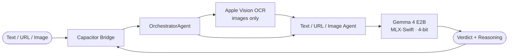

# GemScan

An iOS app that checks suspicious messages, links, and screenshots for scams — fully on-device, in seconds.

Here is a link to test it in beta mode on Apple TestFlight and share feedback: 
[GemScan on TestFlight](https://testflight.apple.com/join/BbrV5uaw)


## Why this exists

In 2023, a mother in Arizona answered her phone and heard her daughter screaming. The voice was indistinguishable — a three-second clip scraped from social media was all it took to clone it. The daughter was safe at home. That same year, **$16.6 B** was lost to fraud in the US alone, and the people most targeted — elders, teenagers, non-native speakers — are the ones today's defences fail.

Cloud-based scam filters work by shipping your private conversations to a server. GemScan was built on a simpler bet: **the people most at risk deserve protection that runs on the phone they already own, in their language, without their messages ever leaving the device.**

## What it does

Paste in a message, link, or screenshot. GemScan tells you in plain language whether it looks **safe**, **suspicious**, or a **scam**, and gives you the reasons it thinks so. Every model runs locally on your iPhone — nothing is uploaded, nothing is logged.

The current build ships with five things you can try:

| Feature | What it does |
| --- | --- |
| **Analyse** | Type or paste a message / URL and tap *Check this*. Returns a verdict, confidence, and reasoning. |
| **Add a picture** | Pick a screenshot from your Photos library. Apple Vision OCR pulls the text out, then the same scam classifier runs on it. |
| **Share Extension** | From any iOS app (Messages, Mail, Safari), tap *Share → GemScan* to send text, a link, or an image straight into the analyser. |
| **History** | Every check is saved locally. See month-to-date and year-to-date counts of Analyses, Scams, and Suspicious items. Tap any row to revisit it. |
| **Learn** | A browsable guide to the eight most common scam patterns — phishing, sextortion, romance, investment, imposter, employment, shopping, malware — with red flags and what to do. |

## Demo walkthrough (for judges)

A 90-second tour of the app:

1. **First-run setup** — open GemScan and head to the *Settings* tab. Tap *Download model* and wait while the Gemma 4 E2B weights pull down (~5 minutes on Wi-Fi). The weights are cached on-device from then on; subsequent launches are instant.
2. **Text path** — paste:
   `Your package could not be delivered. Confirm address: usps-redelivery.shop/track`
   Tap *Check this*. GemScan flags it as a phishing scam and explains why (mismatched sender domain, urgency, suspicious TLD).
3. **Image path** — tap *Add a picture* and pick a screenshot of a suspicious text from the Simulator's Photos library. Vision OCR extracts the text, the verdict appears.
4. **Share path** — open Safari, hit *Share* on any page, choose *GemScan*. The URL gets analysed automatically.
5. **History** — switch to the History tab. See the running totals and tap any past check to view it again.
6. **Learn** — switch to the Learn tab and expand any scam type to read the red-flags playbook.

Airplane mode works for every flow except the Share Extension's network metadata lookup. Toggle it on if you want to verify nothing is leaving the device.

## Run it yourself

You can fully test the app from the web mock without an iPhone, or build the real iOS app:

### Web mock (no Xcode needed)

```bash
git clone https://github.com/GemScan/GemScan && cd GemScan
npm install
npm run dev
```

Open <http://localhost:3000>. The web build swaps in a mock `GemmaPlugin` that returns deterministic verdicts — every screen and every flow is reachable.

### iOS build (real on-device inference)

Requires Xcode 15.3+, an Apple Developer account (free is fine), and ~3 GB free for the Gemma 4 E2B model.

```bash
npm install
npm run build          # static-export the Next.js app
npx cap sync ios       # copy the bundle into the iOS shell
npx cap open ios       # opens Xcode
```

In Xcode: pick an iPhone Simulator (iPhone 15 Pro and up work well) or a paired physical device, then `⌘R`. On first launch, open the in-app *Settings* tab and tap *Download model* to pull the Gemma 4 E2B IT 4-bit weights (~2 GB) from Hugging Face into the app's sandbox — under 5 minutes on Wi-Fi. The weights are reused on every subsequent launch.

See [CONTRIBUTING.md](CONTRIBUTING.md) for the full developer setup, signing notes, and the test commands.

## How it works



When you submit something, a Swift `OrchestratorAgent` picks the right specialist (text, URL, or image), runs Gemma 4 E2B locally through Apple's MLX framework, and parses the model's grammar-constrained output into a `{ verdict, confidence, reasoning }` shape the UI can render. Images take an extra step: Apple Vision pulls the text out first, then the same text path runs on the OCR result.

| Layer | What it's built with |
| --- | --- |
| UI | Next.js 14 (App Router), static-exported and bundled into the iOS WebView |
| Native shell | Capacitor 6 + Swift |
| Inference | MLX-Swift (Apple Silicon GPU), llama.cpp fallback |
| Model | Gemma 4 E2B Instruct, 4-bit quantised (~2 GB) |
| OCR | Apple Vision `VNRecognizeTextRequest` |
| Storage | Zustand + localStorage (history is on-device only) |

## Where to go next

| You are… | Start here |
| --- | --- |
| A developer wanting to build or extend it | [CONTRIBUTING.md](CONTRIBUTING.md) |
| Curious about the agent / inference architecture | [docs/architecture.md](docs/architecture.md) |
| Validating model behaviour in Colab | [notebooks/README.md](notebooks/README.md) |
| Looking for the rest of the docs | [docs/](docs/) |

## License

See [LICENSE](LICENSE).
